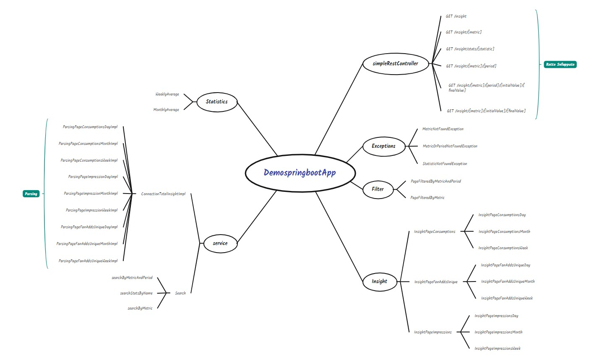

# OOPProjectMarconiSpina
## Introduzione
La seguente applicazione springboot (sviluppata con **GRADLE**) ha l'obiettivo di fornire statistiche sulle insights di una pagina Facebook, permettendo di visualizzare quest'ultime nella loro totalità oppure filtrate (per *periodo*, *metrica* o *valore*).
L'utente potrà visualizzare i risultati dell'esecuzione del programma avviando lo stesso ed utilizzando l'URL "localhost:8080/" seguito dall'endpoint specificato nelle [rotte](#rotte).
Per utilizzare correttamente il programma :
* 1)E' necessario avere l'[access token relativo ad una pagina Facebook](https://developers.facebook.com/docs/pages/access-tokens/), se non si ha una pagina è possibile utilizzare il nostro token di prova : EAAPR8XUrBo8BAIyoPzfu21ZAR3RZA8oWUY8AekdaEnzpt85jNPiwys8MhRu6fze3HvJGJWMlX4OalsnSustHI2bld84k7Jxbo98gl5wgck9ELaXZByRcyX8FHxcM7f4pMJUyjeVXqfwtwOqewn8V5l4ueDnnzBSnVXTD5GMGgE0hZCZB8taUR
* 2)Nella versione attuale del programma è necessario eseguire per prima la rotta [insight](#insight) (in quanto permette di salvare in locale tutte le informazioni provenienti dall'API di Facebook, in modo tale da non dover ripetere chiamate alle API evitando così anche codice superfluo nelle altre rotte).

## Funzionamento
Tra i file caricati nella repository vi è una cartella [FBProject](FBProject) la quale contiene un breve video esplicativo su tutto il funzionamento del programma e una repository di postman che è possibile importare nel proprio workspace in cui sono contenute tutte le rotte(**corrette**) che è possibile eseguire.
Il funzionamento del programma è riassunto attraverso questo schema concettuale:


## Javadoc
Per visualizzare il javadoc relativo al progetto è sufficiente aprire all'interno della cartella javadoc.zip il file "index". 

<a name="rotte"></a>
## Rotte
Le insight visualizzate in formato JSON hanno una struttura standard :
* Nome.
* Descrizione.
* Periodo.
* Valore1 (Relativo a 2 giorni prima rispetto al giorno attuale).
* Valore2 (Relativo a 1 giorno prima rispetto al giorno attuale).

<a name="insight"></a>
### Descrizione
Tipo | Endpoint | Descrizione | Parametri
---- | ---- | ---- | ----
GET | /insight | E' una sorta di comando di avvio del programma , mostra le insight nella loro totalità e salva tutti i dati in un file locale. | Nessuno
GET | /insight/{metric} |  Mostra soltanto la metrica che si sceglie. | InsightPageConsumptions ; InsightPageImpressions ; InsightPageFanAddsUnique ;
GET | /insight/stats/{statistic} | Mostra la media di una precisa metrica all'interno del mese o settimana corrente | MonthlyAverageImpressions, WeeklyAverageImpressions ; MonthlyAverageConsumptions, WeeklyAverageConsumptions ; MonthlyAverageFanAddsUnique, WeeklyAverageFanAddsUnique;
GET | /insight/{metric}/{period} | Mostra una precisa metrica in un determinato periodo | Day ; Week ; Month;
GET | /insight/{metric}/{period}/{initialValue}/{finalValue} | Se il valore2 della metrica è compreso tra initial(più piccolo) e final value(più grande) , allora questa verrà mostrata | N.B. initial e final value sono due interi.
GET | /insight/{metric}/{initialValue}/{finalValue} | Mostra una precisa metrica filtrata in base a due valori (initial e final value). | N.B. initial e final value sono due interi.

## Eccezioni 
Il programma contiene delle eccezioni personalizzate :
* ❌ MetricNotFoundException) : se la metrica inserita non è tra quelle disponibili viene lanciata quest'eccezione, il programma provvederà poi a fornirci una lista di metriche valide e viene stampato il seguente messaggio :  
``` 
Metrica non trovata , le metriche valide sono: )InsightPageConsumptions )InsightPageImpressions )InsightPageFanAddsUnique 
```
* ❌ MetricOrPeriodNotFoundException) : se la metrica o il periodo inseriti non sono tra quelle disponibili viene lanciata quest'eccezione, il programma provvederà poi a fornirci una lista di metriche o periodi validi.
``` 
Metrica o periodo non valido , le metriche valide sono: )InsightPageConsumptions )InsightPageImpressions )InsightPageFanAddsUnique 
I periodi validi sono: )day )week )month
```
* ❌ StatisticNotFoundException) : se la statistica inserita non è tra quelle disponibili viene lanciata quest'eccezione, il programma provvederà poi a fornirci una lista di statistiche valide.
``` 
Statistica non valida , le statistiche valide sono: )MonthlyAverageImpressions )WeeklyAverageImpressions )MonthlyAverageConsumptions )WeeklyAverageConsumptions )MonthlyAverageFanAddsUnique )WeeklyAverageFanAddsUnique
```

## JUnit Test
Nel programma vengono effettuati i seguenti test : 
* ✅ TestFilters) : Testa un metodo che ricerca tra le insights già filtrate per metrica e per periodo quelle che hanno un valore maggiore o uguale dell'initial value e minore o uguale del finale value.  
* ✅ TestSearch) : Testa un metodo che cerca le insight filtrando per nome e per periodo.
* ✅ TestStats) : Testa un metodo che cerca la corretta statistica in base al nome.
